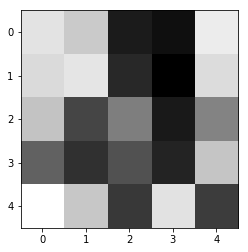

# Facial-Keypoint-Detection
*Disclaimer* : This project is done as a part of the CV Nanodegree, future Udacity students are requested not to copy anything from here. (There are plagiarism checks in place anyway)

## Background
Facial Keypoint detection or Landmark detection implies identifying the various keypoints present on any face. In each training and test image, there is a single face and **68 keypoints, with coordinates (x, y), for that face**.  These keypoints mark important areas of the face: the eyes, corners of the mouth, the nose, etc. These keypoints are relevant for a variety of tasks, such as face filters, emotion recognition, pose recognition, and so on. Here they are, numbered, and you can see that specific ranges of points match different portions of the face.

### Example

## Training and Feature Visualization
Training of the network and feature vizualization is done in the train_feautureviz.py file. The training went on for just 20 epochs with a batch size of 16. Adam optimizer and SmoothL1 loss were used. 

### Before training

### After training 

### Feature vizualization
Examples of **learned** weights in kernels/filters:

   
### Learning in action (example with a single kernel on an input image):
   
This particular kernel learned to detect edges (high frequency areas) in the input image.

## Predicting keypoints

I use a haar cascade to detect faces and consequently use the trained model to detect the facial keypoints (x, y) coordinate pairs. The detected faces (region of interest) are preprocessed: converted to grayscale, normalized, resized (refer predict_keypoints.py for the code and complete documented walkthrough) before actually predicting the keypoints.

### Results

